# 《动感新势力》Vol.1 ：MACROSS 二十周年纪念特辑

## 本期导读

《动感新势力》创刊号从一开始就把气势拉满：随刊光盘、动画新作、主题歌欣赏、排行榜资料和 `MACROSS` 二十周年纪念专题一起登场。本文保留杂志的栏目脉络，并把重点内容重新组织成更适合阅读的图文记录。

本期是《动感新势力》创刊号，核心内容围绕 `MACROSS` 二十周年展开，同时收录多部动画新作预告、片头曲资料、排行榜、DVD 销售信息与制作特典。

主要栏目包括：

- `MACROSS` 二十周年纪念专题
- 《战斗妖精雪风》宣传海报与人物设定
- 《Aquarian Age Saga II》《千年女优》《eX-Driver the Movie》等动画作品介绍
- `Chobits` 与《再造人009》的片头曲欣赏
- 动画人气榜、DVD 销售榜、新作 DVD 发售信息
- `MINIPATO`、`PATLABOR WXIII` 与下期预告

## 栏目汇总

### 新作预告

- 《战斗妖精雪风》：以战斗机、未知异星体和 FAF 防卫组织为核心，强调飞行员深井零与爱机“雪风”的关系。
- 《Aquarian Age Saga II》：卡片游戏衍生促销动画，重点介绍多个超能力/魔法势力。
- 《Macross Zero》：Macross 20 周年新系列 OVA，设定在初代 TV 前一年，主打 5.1 声道和新影像表现。
- 《EX-Driver the Movie》：藤岛康介企画/原案/人物设定，描写 AI 汽车时代中驾驶手动汽车处理事故的 EX-D 组织。
- 《千年女优》：今敏监督作品，以女演员回忆人生与跨越时空的叙事为核心。
- 《PATLABOR WXIII》：机动警察剧场版第三作，主打机械犯罪与悲剧调查。

### 片头/MTV 欣赏

- 《Chobits》OP《Let me be with you》：收录歌曲信息、歌词与中文译文。
- 《再造人009》OP：围绕 001-009 号战士的能力做快速介绍。

### 特辑

- Macross 20 周年纪念：
  - 回顾初代故事与制作影响。
  - 梳理《可曾记得爱》《Macross II》《Macross Plus》《Macross 7》《Macross Zero》等系列节点。
  - 讨论音乐/情歌在 Macross 世界中的核心地位。
  - 提及 Robotech 与 Macross 的历史关系和差异。

### 动画排行与销售

- 当月人气榜中，《机动战士 GUNDAM SEED》表现突出：男角色、女角色与作品榜均占据高位。
- DVD 销售榜前三为《美女与野兽 特别编辑版》《天空之城》《数码怪兽 特别编辑版》。
- 新作发售表覆盖 TV、OVA、MOVIE 多类别作品。

## 逐图整理

### 001 封面

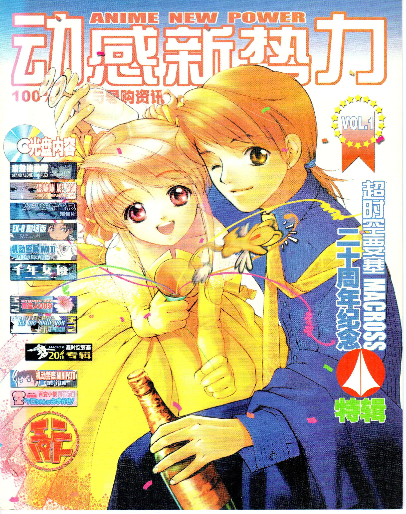

创刊号封面以《月与她的花》为封面故事，右侧醒目标出“超时空要塞 MACROSS 二十周年纪念特辑”。左侧列出光盘与本期收录内容，包括《攻壳机动队 STAND ALONE COMPLEX》《Aquarian Age Saga II》《战斗妖精雪风》《eX-Driver 剧场版》《机动警察 WXIII》《千年女优》《再造人009》《Chobits》主题歌以及 `MINIPATO` 等。

### 002 光盘内容目录

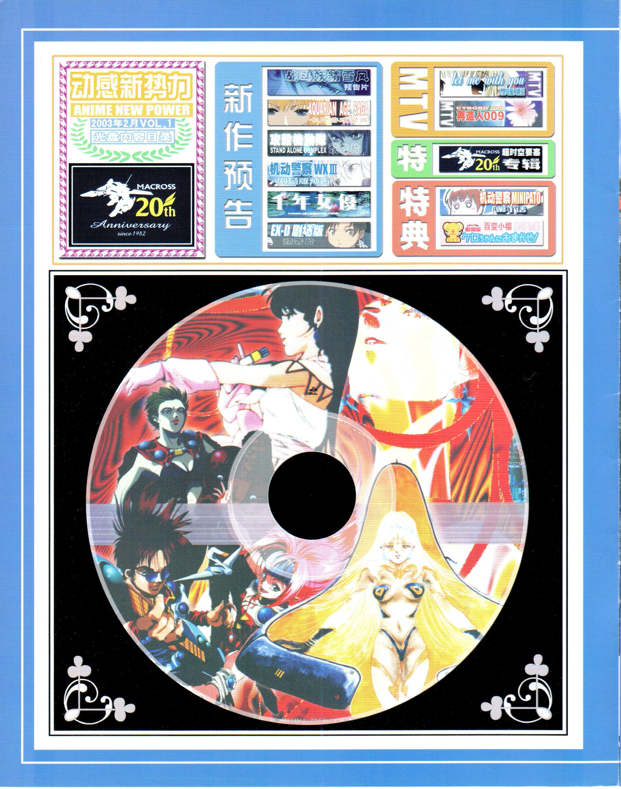

随刊光盘内容总览按“新作预告”“MTV”“特辑”“特典”等分区列出收录项目。可以看出本期光盘与纸质内容互相配合：新作预告对应多部动画，MTV 收录 `Chobits` 与《再造人009》，特辑则指向 `MACROSS` 二十周年。

### 003 目录与栏目入口

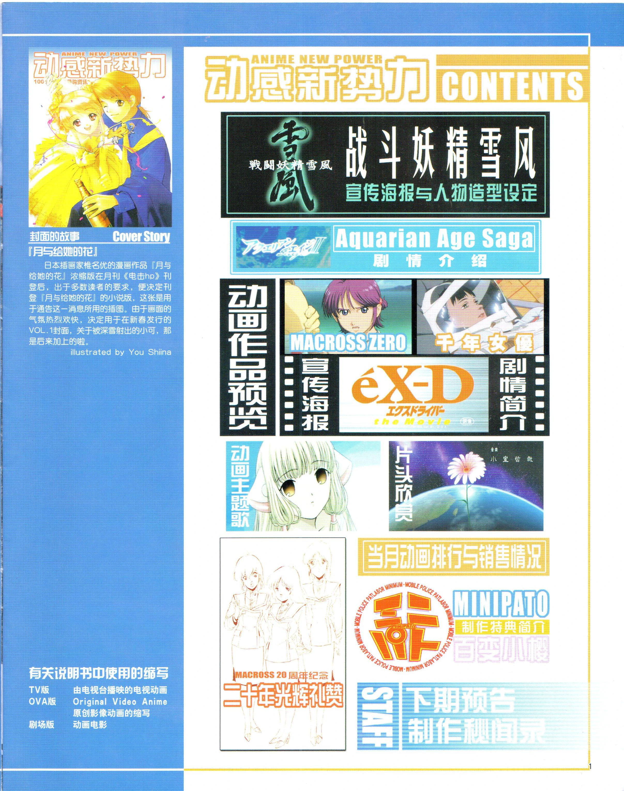

目录页确认了本期的主体结构：先从《战斗妖精雪风》《Aquarian Age Saga II》《MACROSS ZERO》《千年女优》《eX-Driver the Movie》等动画预告进入，再展开 `MACROSS` 二十周年专题、动画排行榜与销售资料、`MINIPATO` 制作特典、百变小樱短片花絮以及下期预告。

### 004 《战斗妖精雪风》宣传海报

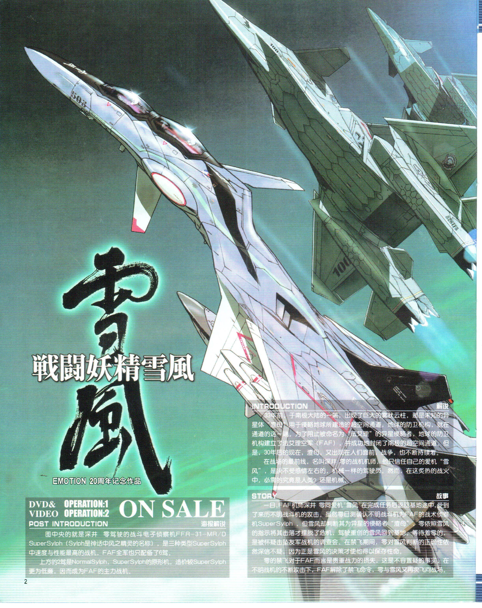

这组内容介绍 `EMOTION 20 周年纪念作品`《战斗妖精雪风》。文章从 DVD 与 VIDEO 的发售信息切入，延伸到机体 `FFR-31MR/D SuperSylph` 的设定，再把故事背景铺开到人类与神秘敌人 JAM 的战争、FAF 航空部队，以及主角深井零与“雪风”之间近乎共生的关系。

### 005 《战斗妖精雪风》人物设定

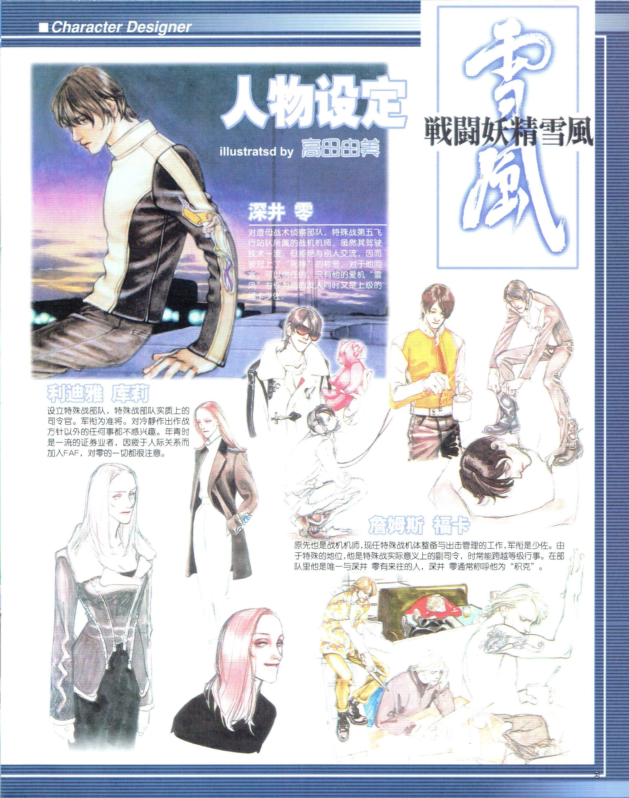

人物设定部分标注插画为高田由美，重点角色包括深井零、利迪雅·库利、詹姆斯·福卡等。它承接前面的世界观与机体介绍，进一步说明角色关系、军衔与各自在特殊战部队中的位置。

### 006 《Aquarian Age Saga II》剧情介绍

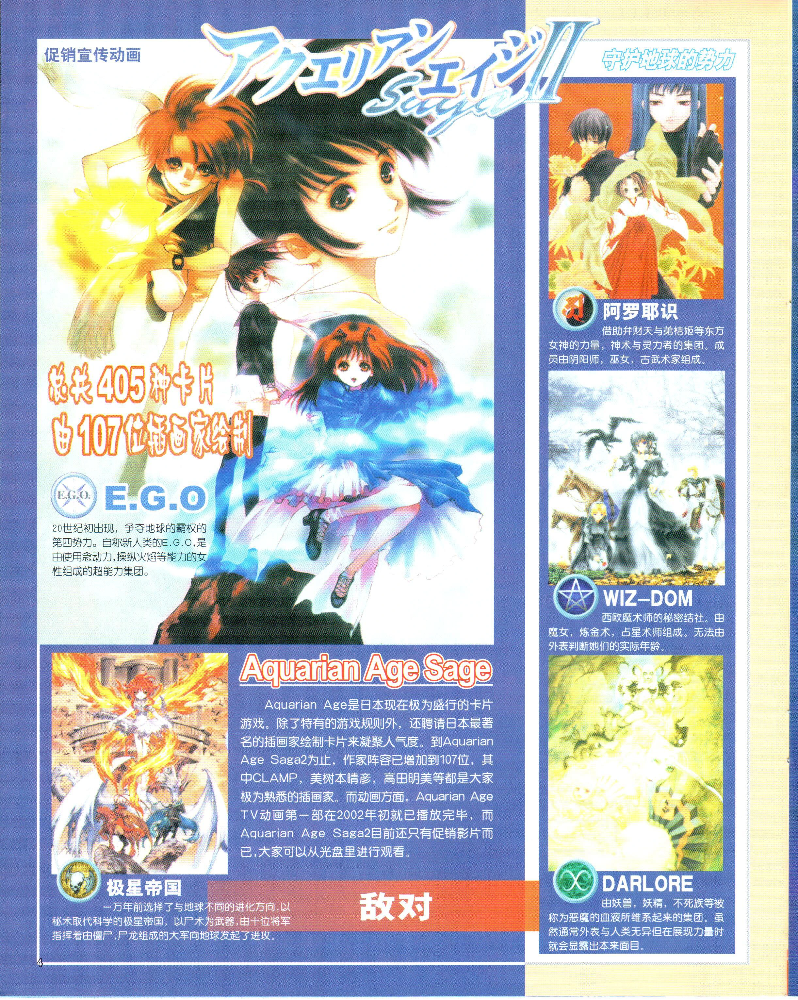

《Aquarian Age Saga II》的促销介绍带出一个由卡片游戏延伸而来的超能力世界。动画版以多方势力对抗为核心，文中提到 `E.G.O`、极星帝国、阿罗耶识、`WIZ-DOM`、`DARKLORE` 等阵营，信息密度很高。

### 007 《MACROSS ZERO》DVD 发售广告

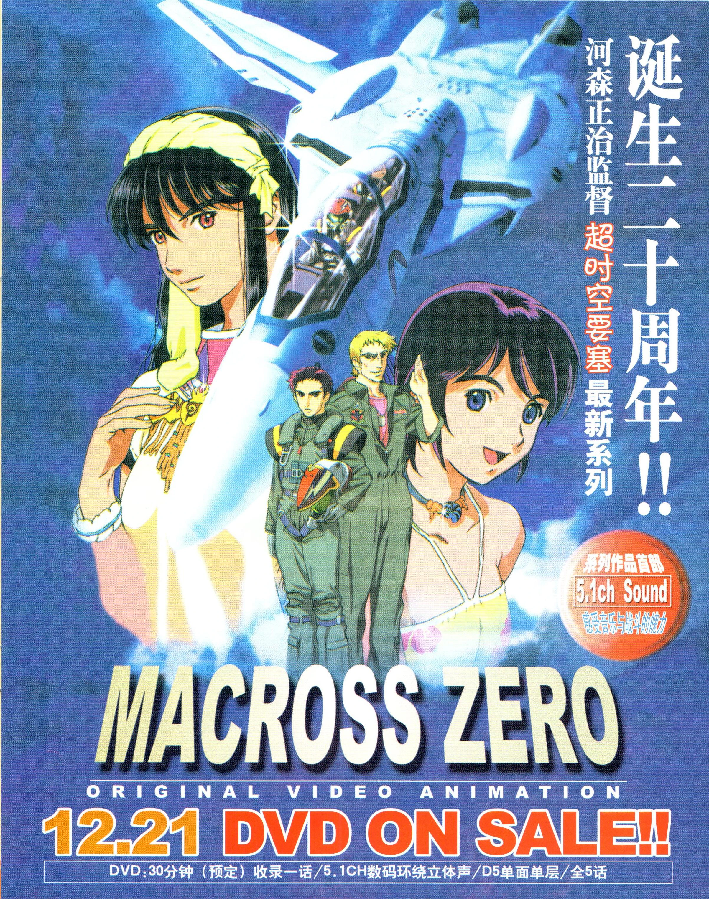

《MACROSS ZERO》的发售资讯标注“河森正治监督”“超时空要塞最新系列”，并突出 `5.1ch Sound` 与 DVD 发售日期。它在创刊号中的位置很巧妙，既是新作预告，也为后面的 `MACROSS` 二十周年专题提前预热。

### 008 《千年女优》作品介绍

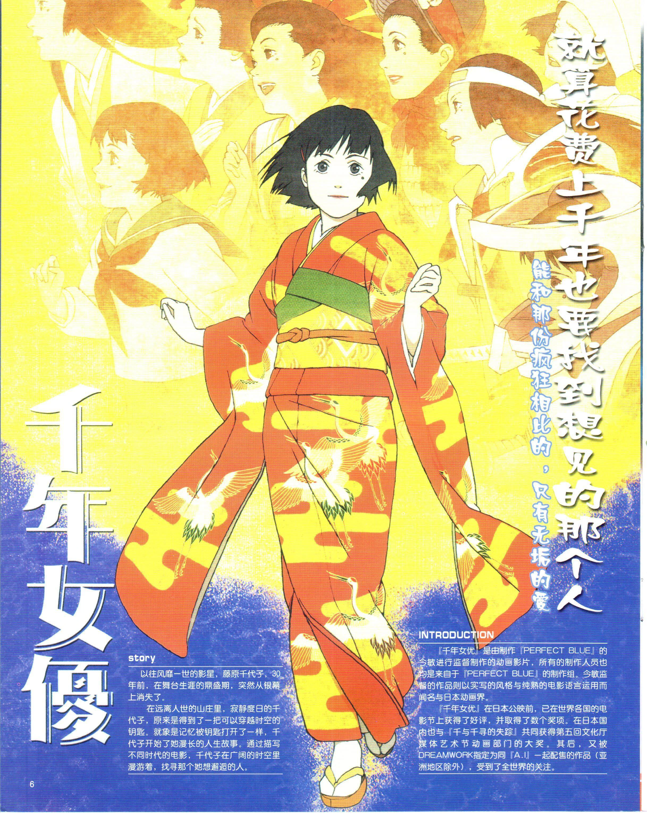

今敏监督的《千年女优》在这里被放在新作介绍中重点推荐。正文提到作品由《PERFECT BLUE》的制作人员参与，以藤原千代子的人生回忆展开，并借不同时代的电影段落追寻她心中的那个人。文中也提到本片在海外电影节获得好评，并与《千与千寻》同获文化厅媒体艺术祭动画部门大奖。

### 009 《eX-Driver the Movie》剧情与角色

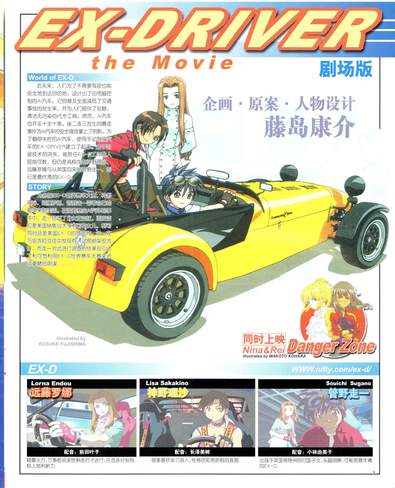

《eX-Driver the Movie》的设定围绕电脑控制的 AI 汽车与负责处理失控事件的 `EX-DRIVER` 展开。剧场版故事涉及世界大赛、少女安吉拉，以及围绕 AI 汽车事件展开的调查；角色资料则列出远藤罗娜、神野理沙、菅野走一等主要人物与配音信息。

### 010 `Chobits` 片头曲《Let me be with you》

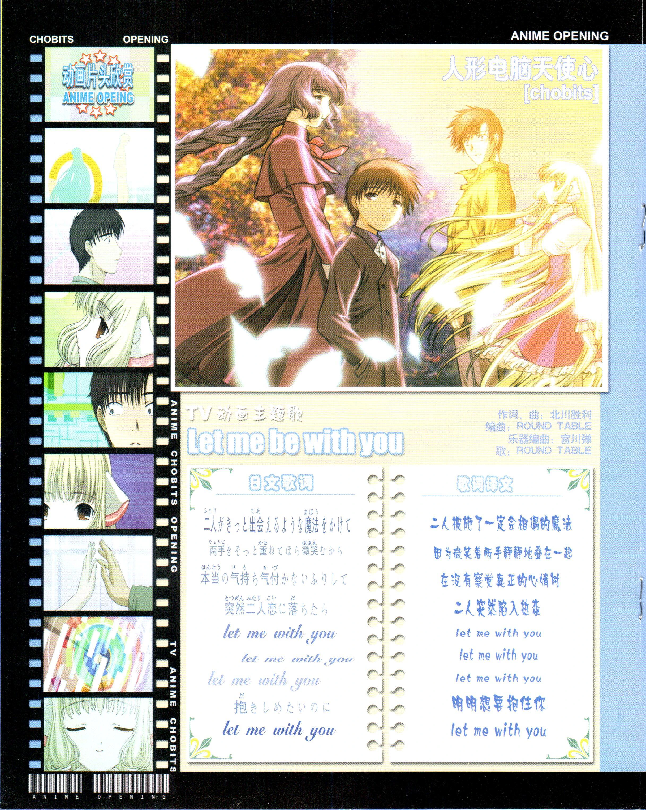

“动画片头欣赏”栏目之一收录 `Chobits` 片头曲《Let me be with you》。这里整理了日文歌词与中文译文，并标注作词、作曲、编曲与演唱均与 `ROUND TABLE` 相关。

### 011 《再造人009》片头与角色能力

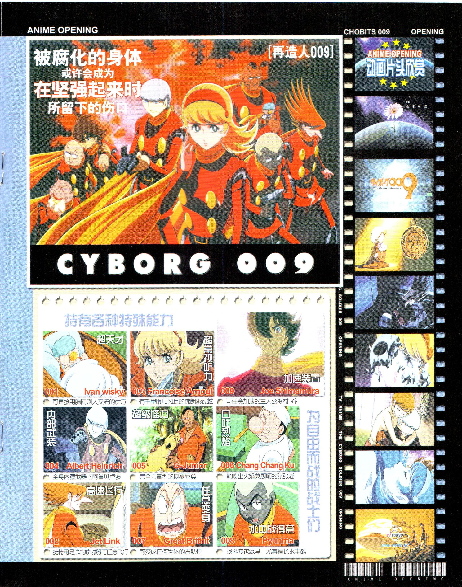

“动画片头欣赏”继续转向《再造人009》。上半部分以片头曲氛围和团队形象为主，下半部分整理 001 至 009 号成员的特殊能力，如超天才、超常视听力、加速装置、内部武装、力自由控制等。

### 012 `MACROSS` 二十周年专题扉页

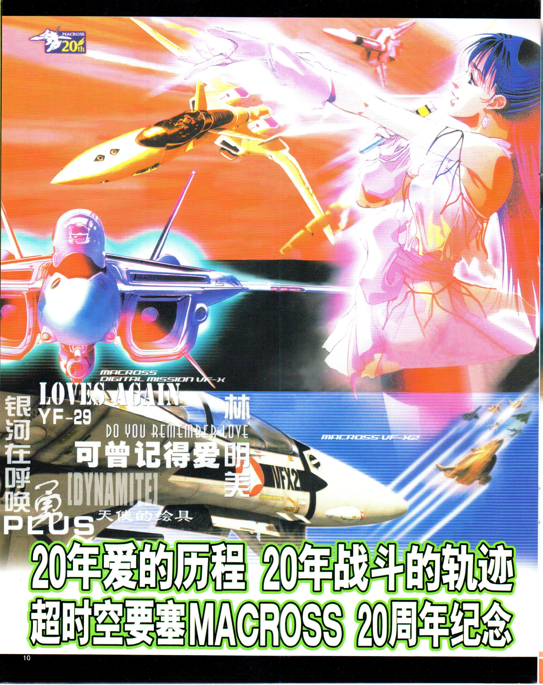

`MACROSS` 二十周年专题以“20 年爱的历程，20 年战斗的轨迹”开场。图中汇集 `Do You Remember Love`、`Lovers Again`、`Dynamite 7`、`PLUS`、`VF-29`、`VF-X2` 等关键词，为后文的系列回顾铺垫。

### 013 `MACROSS` 系列回顾上篇

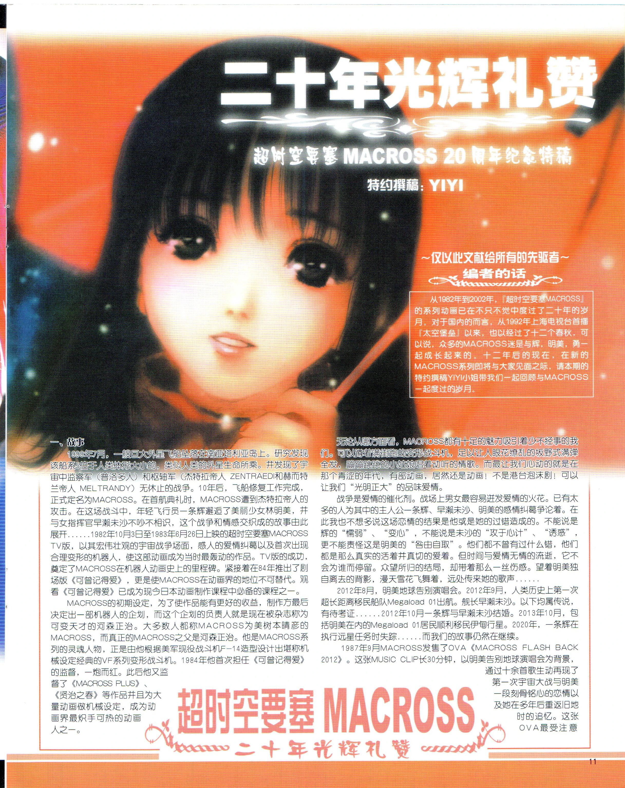

专题正文从 1999 年外星飞船坠落南亚塔利亚岛讲起，回顾 `SDF-1 MACROSS` 的修复、杰特拉帝人与美特兰帝人的战争，以及一条辉、林明美、早濑未沙之间的情感线。文章也谈到 1982 年 TV 版的影响、1984 年剧场版《可曾记得爱》的地位，以及河森正治在机体设定与系列发展中的作用。

### 014 `MACROSS` 系列回顾下篇

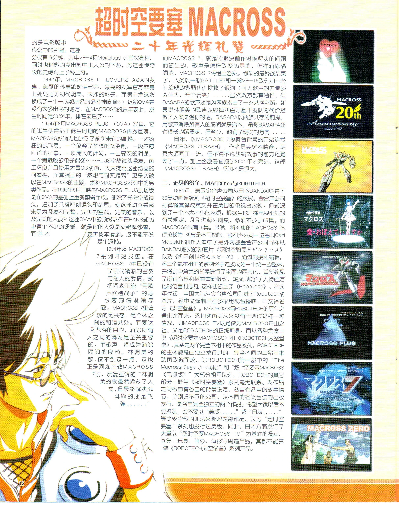

专题继续梳理系列发展，提到 `MACROSS II LOVERS AGAIN`、`MACROSS PLUS`、`MACROSS 7` 与《MACROSS 7 TRASH》。文章后半转向 `ROBOTECH` 与 `MACROSS` 的关系，说明《太空堡垒》由多部日本动画重新剪辑、改写而成，因此与原本的《超时空要塞》系列不能简单混为一谈。

### 015 歌声、爱情与 `MACROSS ZERO`

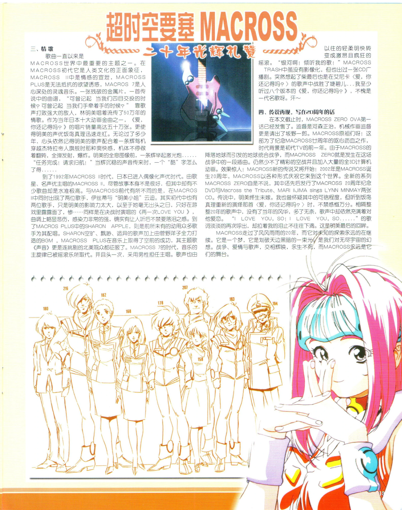

专题最后一页把焦点放到 `MACROSS` 的音乐传统上：林明美的《爱，你还记得吗？》、`MACROSS II`、`MACROSS PLUS` 中的 `SHARON APPLE`、以及 `MACROSS 7` 的摇滚路线。结尾回到二十周年纪念，提到 `MACROSS ZERO`、纪念 CD 与饭岛真理重新演绎林明美歌曲所带来的怀旧意味。

### 016 动画排行与 DVD 销售

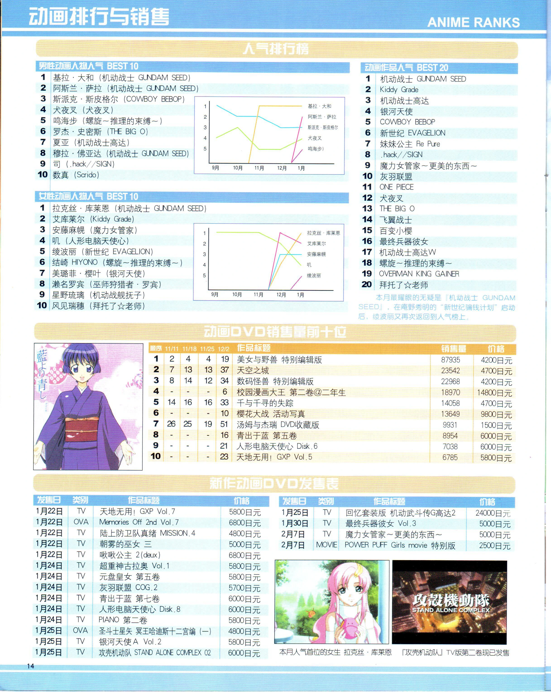

资料型栏目分为人气排行榜、DVD 销售前十与新作动画 DVD 发售表。人物榜中 `GUNDAM SEED` 的基拉、阿斯兰与拉克丝非常突出；作品榜首位同样是《机动战士 GUNDAM SEED》。DVD 销售榜列出《美女与野兽 特别编辑版》《天空之城》《数码怪兽 特别编辑版》等销量与价格信息。

### 017 `MINIPATO` 与百变小樱特典

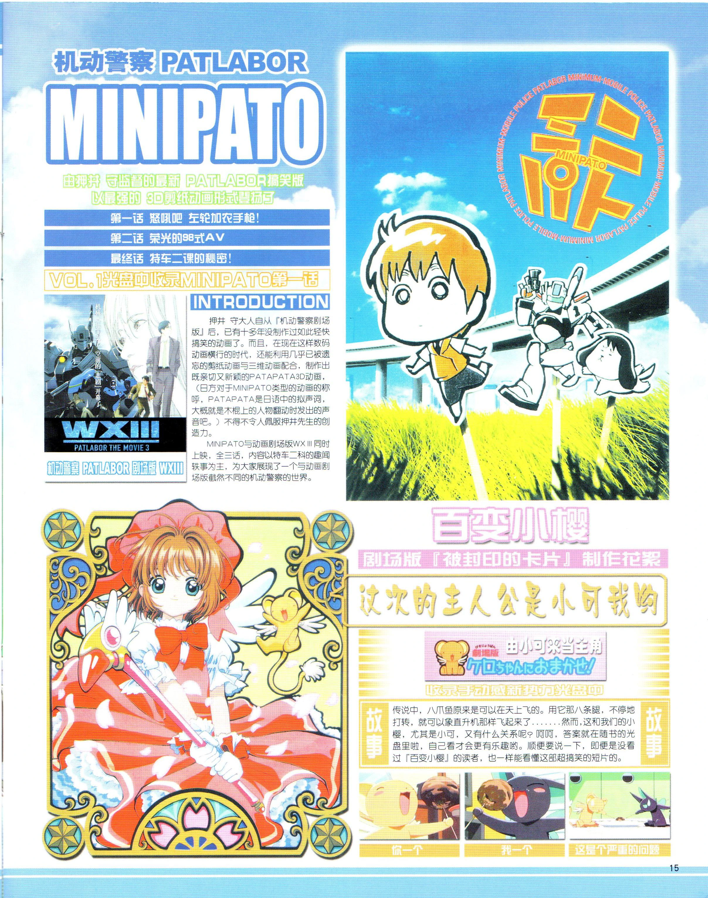

《机动警察 PATLABOR》的短篇特典 `MINIPATO` 强调押井守参与，以短小搞笑和 `PATAPATA 3D` 动画形式呈现，并列出第一话、第二话和最终话标题。下半部分是百变小樱剧场版《被封印的卡片》的制作花絮，主题为“小可”相关短片。

### 018 STAFF 与下期预告

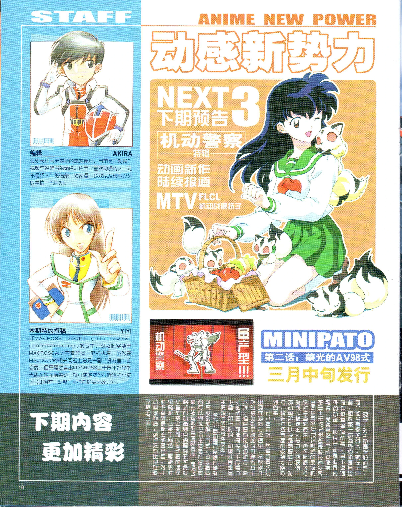

编辑与特约撰稿介绍中出现 `AKIRA` 与 `YIYI`。右侧的下期预告显示，第 3 期将推出机动警察特辑、动画新作后续报道、`FLCL` MTV，以及 `MINIPATO` 第二话“荣光的 AV98 式”。

### 019 封底与出版信息

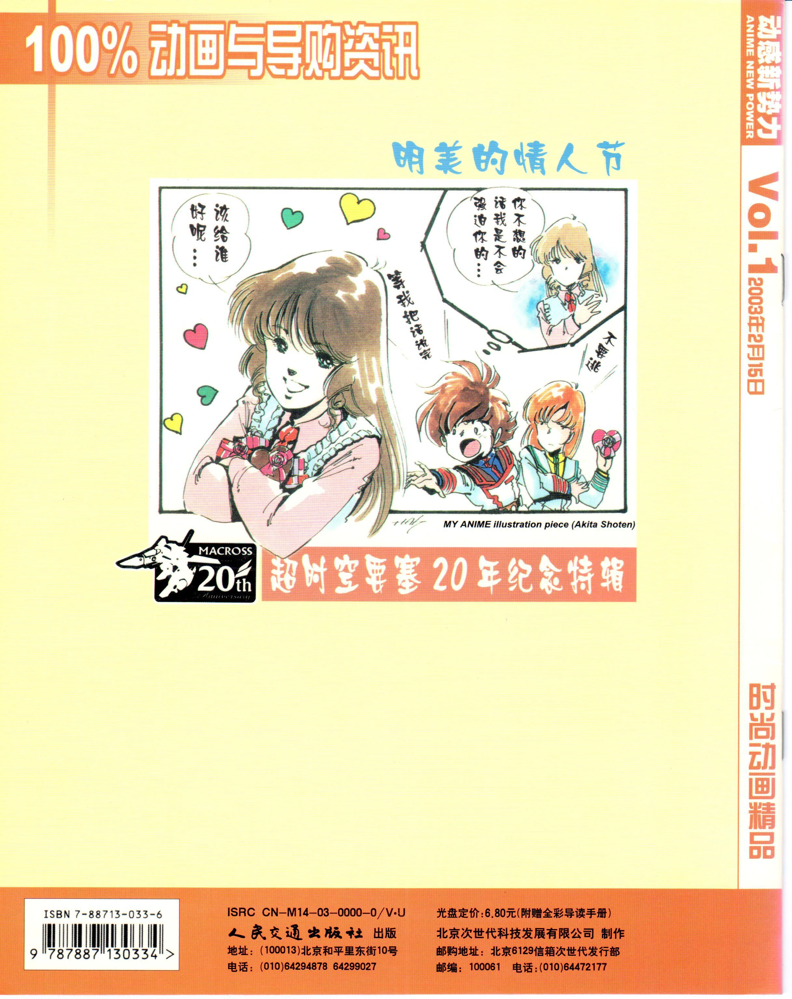

封底延续 `MACROSS` 二十周年纪念主题，中央引用 `MY ANIME illustration piece (Akita Shoten)`。底部列出 ISBN、ISRC、出版单位、制作单位、邮购地址、定价与发行信息，是确认本册出版资料的重要依据。

### 020 《机动警察 PATLABOR WXIII》广告

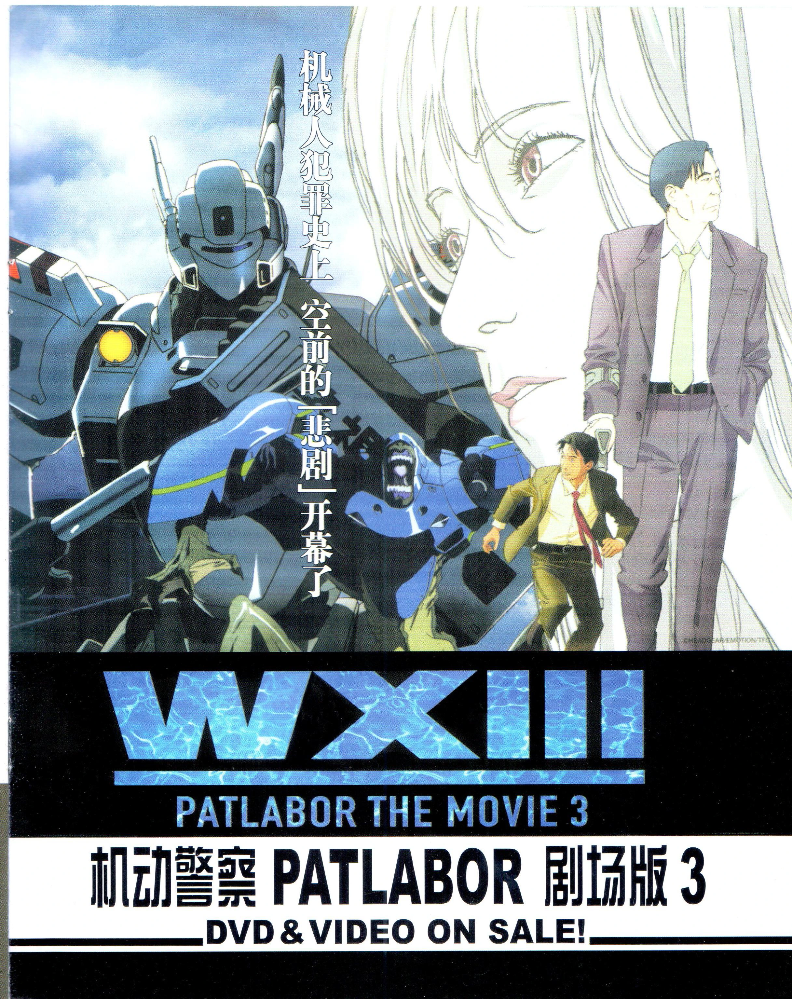

最后收录《机动警察 PATLABOR WXIII》DVD 与 VIDEO 发售广告，标题强调“机械人犯罪史上空前的悲剧开幕了”。它与前面的 `MINIPATO` 特典内容互相呼应，构成本期 `PATLABOR` 相关内容的收尾。

## B站 MTV/PV 视频选集

本期对应 B 站合集中的 2 个 MTV/PV 选集，按分 P 顺序整理如下。

### P1 1期MTV 「人型电脑天使心」片头曲 → Let me be with you

<iframe src="https://player.bilibili.com/player.html?bvid=BV1Dx411F7D1&amp;page=1&amp;autoplay=0" width="100%" height="468" allowfullscreen loading="lazy"></iframe>

### P2 1期MTV 「再造人 009」片头欣赏

<iframe src="https://player.bilibili.com/player.html?bvid=BV1Dx411F7D1&amp;page=2&amp;autoplay=0" width="100%" height="468" allowfullscreen loading="lazy"></iframe>

